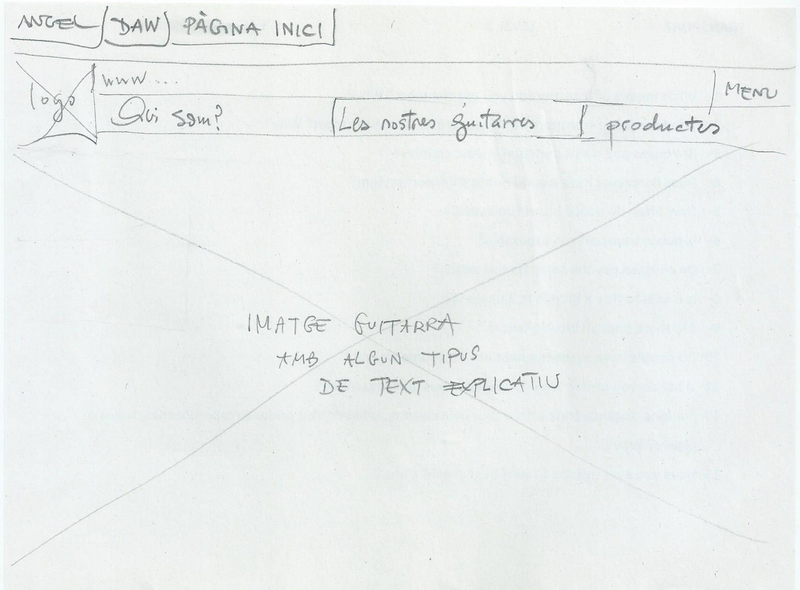
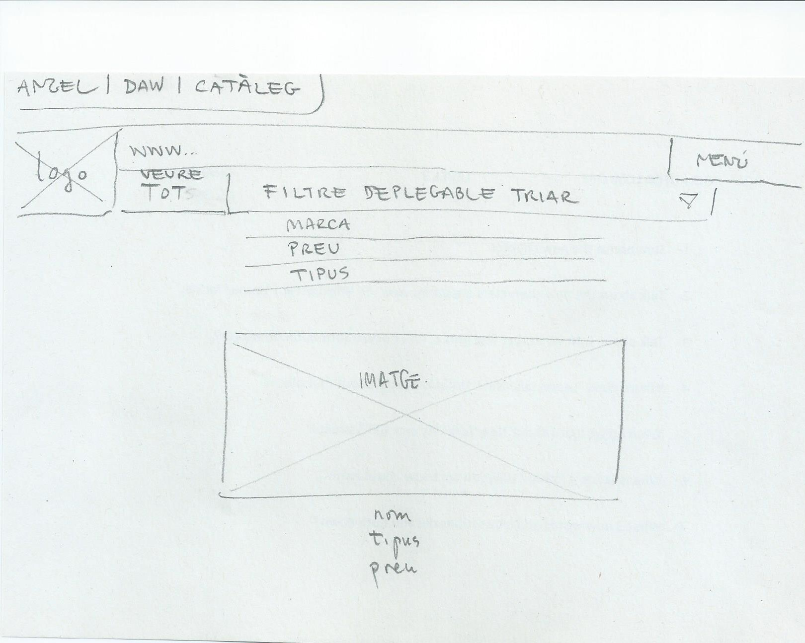

# P0_wireframe

# Aquest repositori de GitHub és de:
_Antonio Susany_
i
_Angel Ivanov_

# per la tasca de Wireframe

## Branca d'Angel

- _Wireframe 1: Pàgina d'Inic_

La pàgina d'inici tindrà el logo, accés al menú, els apartats de: Qui som?, Les nostres guitarres i Productes. La resta de l'espai estarà ocupat per una imatge d'una guitarra amb algun tipus de text.

- _Wireframe 2: Catàleg dels productes_

La pàgina del catàleg tindrà el logo, accés al menú, l'apartat de Veure tot, per veure tots els articles sense cap filtre. Per últim, tenim la pestanya desplegable amb les opcions de visualització de les guitarres per marca, preu i tipus. Els articles amb o sense filtre aplicat es veuran un per un de dalt cap a baix amb imatge, nom, tipus i preu.

- _Wireframe 3: Detalls del producte_

La pàgina dedicada al detall del producte tindrà el logo, accés al menú, accés al carretó, al filtre desplegable i veure tot. La visualització de l'article: a la part esquerra de la web es veurà l'article en una imatge gran i al costat dret hi seran els detalls com el nom, la descripció, el preu i tres botons: comprar, característiques del producte i opinions.

------------------------Leyenda MarkDown------------------- lista no numerada: +/*/- Elemento 1 encabezado: ### Titulo 1 negrita: /texto en negrita/ cursiva: /texto cursiva/ enlace: Visita Google imagen desde archivo: 