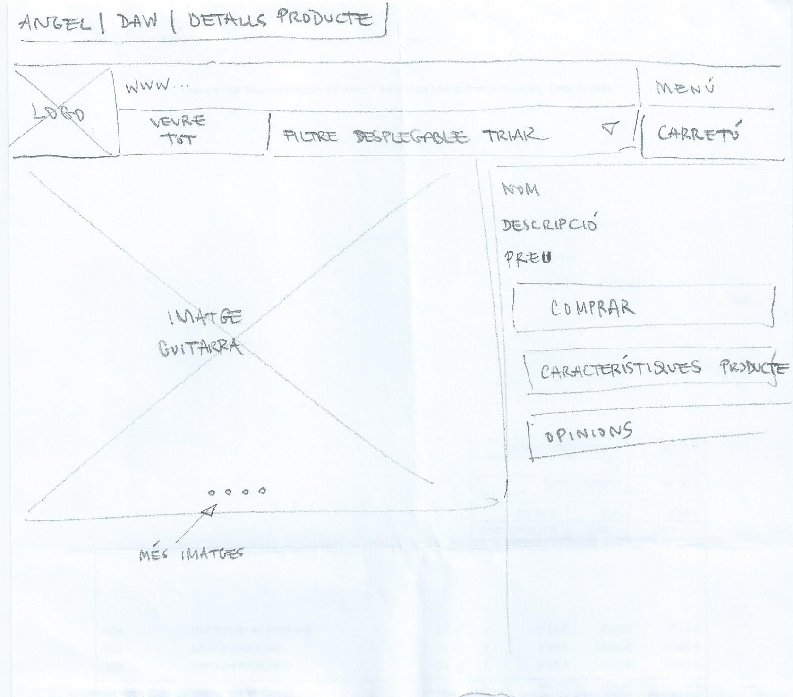

# P0_wireframe

# Aquest repositori de GitHub és de:
_Antonio Susany_
i
_Angel Ivanov_

# per la tasca de Wireframe

branca_Antonio

## HOME

Quan entres a l'aplicació et trobes un "home" que mostra el logo/nom de l'aplicació. De fons es veuran imatges de guitarres, accessioris o informació important de la marca. Aquestes imatges es poden fer scroll cap a l'esquerra o es mouràn automaticament cada cert temps. A sota trobem el menú on l'usuari podrà accedir facilment al buscador, a la cistella o al perfil de l'usuari. 

## BUSCADOR(LUPA)

En el buscador trobem a dalt de tot un filtratge ràpid, si hi han moltes opcions es pot fer scroll horitzontal per veure els diferents filtres. Més a sota trobem un número de totes les opcions disponibles depenent del filtre utilitzat, o sense filtre. Just a la dreta trobem el botó per poder filtrar productes més a fons, més endevant veurem com es aquesta pàgina. Cada producte mostra pirncipalment una foto, una descripció breu i el seu preu. Cada producte, dins del seu rectangle, trobem els botons de "m'agrada" i de "afegir a la cistella". A sota de la pàgina seguim veient el menú de l'aplicació. 

## FILTRADOR

Després de clicar al botó de filtratge en la pàgina del buscador, trobarem una pàgina que veurem diferents filtres per filtrar com ara: Ordenar per novetats i preu, tipologia, color i rang de preu. A sota de tot veurem el botó de "Veure resultats". A dalt de tot de la pàgina, a l'esquerra trobem el botó per sortir del filtrador i a la banda dreta per netejar els filtres. 

## CISTELLA

En la pàgina de la cistella trobem un botó per poder afegir més productes. Per cada profucte es veurà la seva fotografia, el preu i el seu nom. A més a més per cada producte, tindrem un botó per poder eliminar-lo de la cistella. A sota trobem el preu total y un botó per passar a la pàgina de pagament. A sota del tot trobem, també, el menu. 

## NOTICIES

En l'apartat de noticies , sortirà cada noticia en un rectangle on sortirà el titol de la noticia i un link per entrar. Es fa un scroll cap abaix per seguir veient les noticies. 

## PAGAR

A l'hora de fer el pagament, es podrà entrar desde la cistella i clicant el botó de "PAGAR". En aquesta pàgina veurem la quantitat a pagar y uns inputs per introduir el numero de targeta, el CVV, la data de caducitat y el nom del titular de la targeta. També ofereix altres opcions de pagament com ara Bizum, PayPal o Revolute. 

## PRODUCTE

Després de clicar sobre un producte en el buscador de productes podrem veure'l mes a fons, mes imatges, mes descripció. Tenim un botó que podem veure les resenyes del producte. Desde aquesta pàgina també podem afegir els productes a la cistella o donar-li's m'agreada. 

## INICIAR SESSIÓ

Quan ens trobem en l'apartat més a la dreta, podem veure que ens podem iniciar sessió. Demana el correu i la contrasenya. Tenim un botó per poder recuperar la contrasenya. Tenim un botó per Iniciar Sessió y un més abaix per registrar-se si ho estem. 

## Branca d'Angel

- _Wireframe 1: Pàgina d'Inic_

La pàgina d'inici tindrà el logo, accés al menú, els apartats de: Qui som?, Les nostres guitarres i Productes. La resta de l'espai estarà ocupat per una imatge d'una guitarra amb algun tipus de text.

- _Wireframe 2: Catàleg dels productes_

La pàgina del catàleg tindrà el logo, accés al menú, l'apartat de Veure tot, per veure tots els articles sense cap filtre. Per últim, tenim la pestanya desplegable amb les opcions de visualització de les guitarres per marca, preu i tipus. Els articles amb o sense filtre aplicat es veuran un per un de dalt cap a baix amb imatge, nom, tipus i preu.

- _Wireframe 3: Detalls del producte_

La pàgina dedicada al detall del producte tindrà el logo, accés al menú, accés al carretó, al filtre desplegable i veure tot. La visualització de l'article: a la part esquerra de la web es veurà l'article en una imatge gran i al costat dret hi seran els detalls com el nom, la descripció, el preu i tres botons: comprar, característiques del producte i opinions.

- _Wireframe 4: Cistella de Compra i Checkout_

La pàgina dedicada al carretó o cistella tindrà el logo -que sempre condueix a l'inici de la pàgina-, accés al menú, i en la part central es veurà el carretó o cistella amb els productes seleccionats per l'usuari. Si l'usuari vol continuar haurà de premiar el botó 'pagar' per anar al formulari de pagament.

La pàgina dedicada al pagament de la cistella tindrà el logo, accés al menú, i en la part central es veurà el formulari-resum per acabar l'operació de pagament. A dalt de tot es tornarà a mostrar el preu total. Després, l'adreça d'enviament i quan l'usuari tries el mètode de pagament es mostrarien els camps corresponents per recollir les dades de pagament. Finalment, l'usuari hauria de clicar al botó de 'pagar' per finalitzar el procés de compra.

- _Wireframe 5: Autenticació i Registre d'Usuaris_

En la part central de la pàgina es trobarà el formulari de registre amb els mínims i necessaris camps com: nom, correu electrònic, contrasenya i el botó de 'aceptar'.

A la part central de la pàgina estarà situat el formulari d'inici de sessió amb els camps de correu i contrasenya. Hi haurà dos botons, el d'entrar i de recuperar la contrasenya. En premiar el botó de recuperar contrasenya s'enviarà un missatge al correu con la nova contrasenya.

- _Wireframe 6: Blog i Notícies_

La pàgina està dedicada al blog que mostrarà articles de la temàtica de la web: les guitarres. Mostrarà els articles en la part central de la web i un de baix de l'altra. Inicialment, els articles es veuran en format resumit amb una petita imatge i fent-hi clic es podrà accedir.

------------------------Leyenda MarkDown------------------- lista no numerada: +/*/- Elemento 1 encabezado: ### Titulo 1 negrita: /texto en negrita/ cursiva: /texto cursiva/ enlace: Visita Google imagen desde archivo: 

