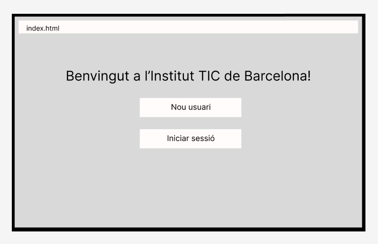
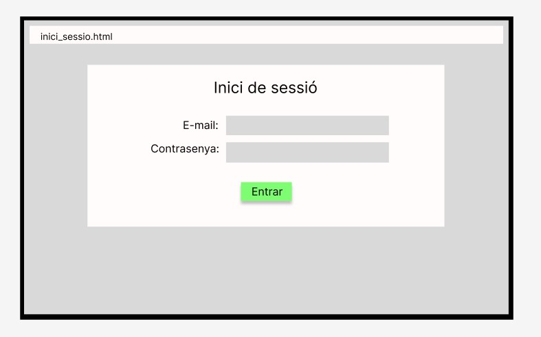
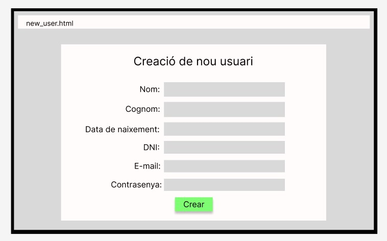
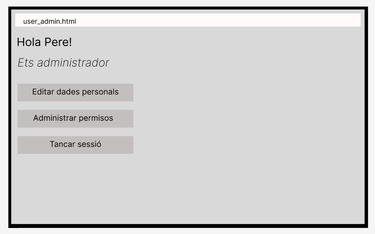
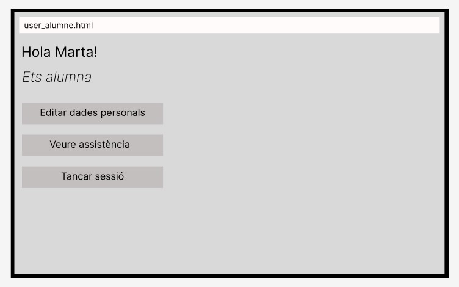
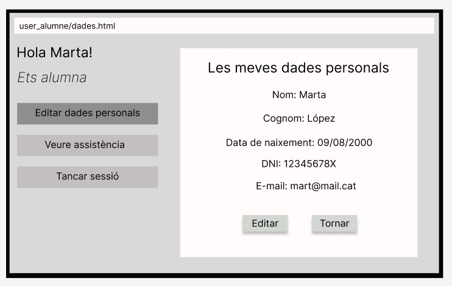
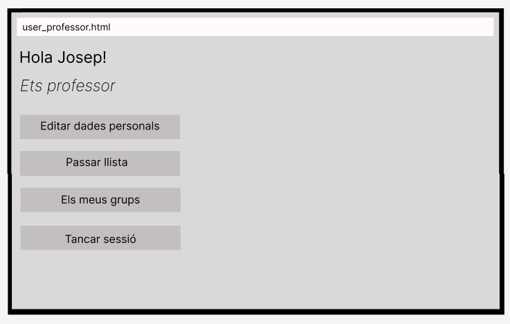
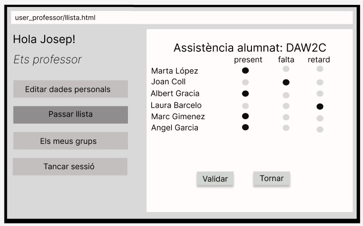
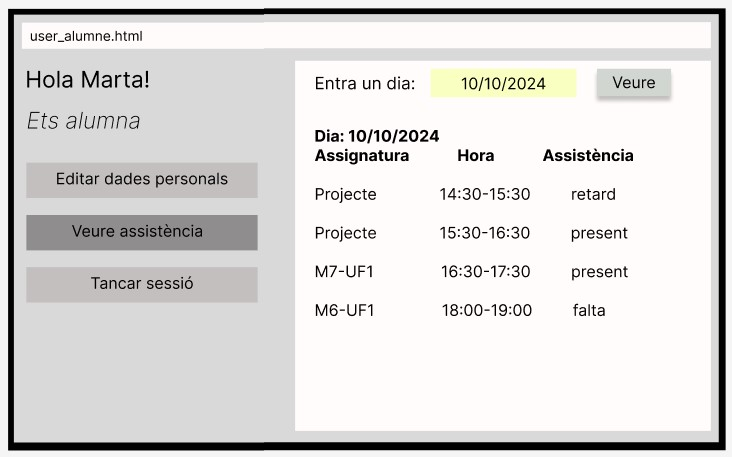

# Readme fet per les imatges dels wireframes fets amb Figma pel Sprint1

## Wireframes fets amb Figma per la secció web del projecte (Angel Ivanov)

+ Crear pàgina d'inici

+ Crear pàgina inici de sessió

+ Crear pàgina de creació de nou usuari

+ Crear pàgina opcions d'administrador

+ Crear pàgina opcions d'alumne

+ Crear pàgina vista i edició de dades personals

+ Crear pàgina opcions de professor

+ Crear pàgina professor passa llista d'assistència

+ Crear pàgina alumne veure assistència

------------------------Leyenda MarkDown------------------- lista no numerada: +/*/- Elemento 1 encabezado: ### Titulo 1 negrita: /texto en negrita/ cursiva: _texto cursiva_ enlace: Visita Google imagen desde archivo: 