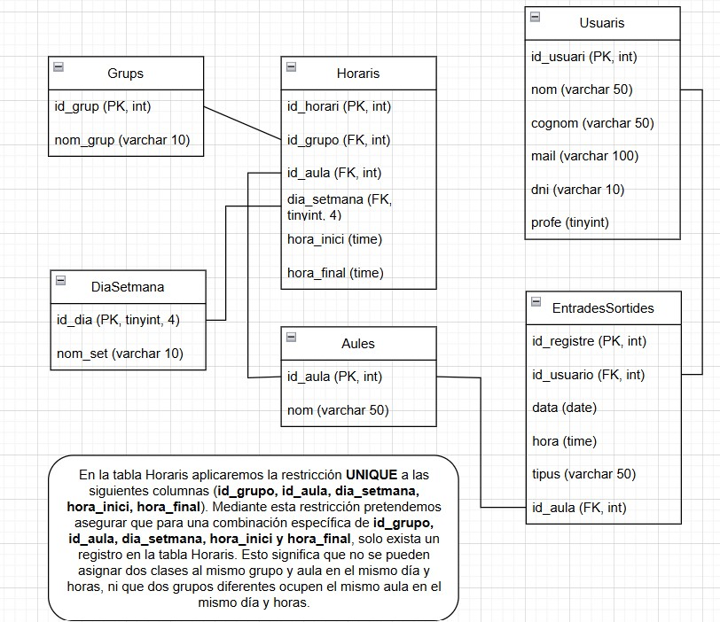

## Diseño de nuestra base de datos

## Guía de estilos // Parte web

### 1. Paleta de colores

- color de fondo: gris claro

- color de fondo de los contenedores: blanco

- color de texto: negro

- color de los botones de acción como Iniciar sesión o crear usuario: verde. Resto de botones, gris

- color de estado de error o mensajes de error: rojo

### 2. Tipografía

- fuente principal: una fuente sans-serif como Roboto o Open Sans, que son claras y adecuadas para pantallas digitales

- títulos: tamaño de 24px

- texto cuerpo: tamaño 14px

### 3. Componentes de interfaz de usuario (UI)

- botones: rectangulares con esquinas redondeadas

- color de los botones: para acciones positivas como guardar, entrar o crear en verde sino un tono de gris

- hover sobre botón: un tono más oscuro del color previo al hover

- campos de entrada o input de estilo rectangular con focus sobre el campo elegido

- contenedores de información: cajas de color gris sobre fondo blanco

- tablas: sin marcar visualmente las celdas y filas; para la asistencia label>input>radio

### 4. Comportamiento y experiencia de usuario (UX)

- mensaje de bienvenida a la home y también después de iniciar sesión

- la app dispone de diferentes roles (alumno, profesor, administrador)

- al finalizar una acción con éxito o si surge algún error saldrá una ventana emergente (tipo alert de JS) avisando del problema o éxito de la operación.

- menú lateral y navegación: situado en el lado izquierdo con las opciones disponibles para cada rol.

- la sección activa del menú lateral izquierdo cambia a un color más oscuro para apreciarse la sección u opción escogida.

### 5. Estilo de comunicación

- lenguaje empleado: es formal, pero también cercano

- mensajes de error y ayuda: cortos y precisos encaminados a dar una explicación precisa de lo sucedido: “nuevo usuario creado con éxito” o “correo electrónico inválido”

### 6. Iconografía y gráficos

- tablas: para la asistencia de alumnos se empleará el html label tag>input>radio

